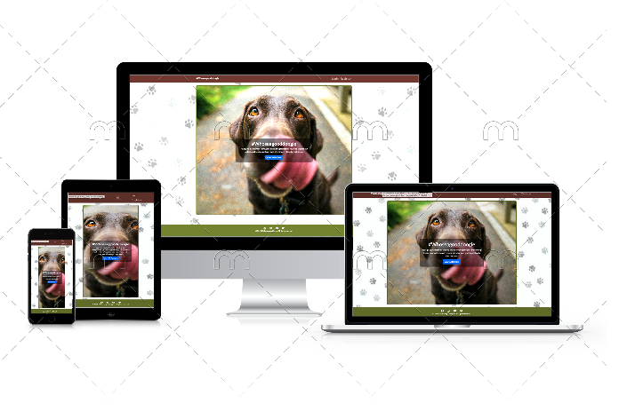
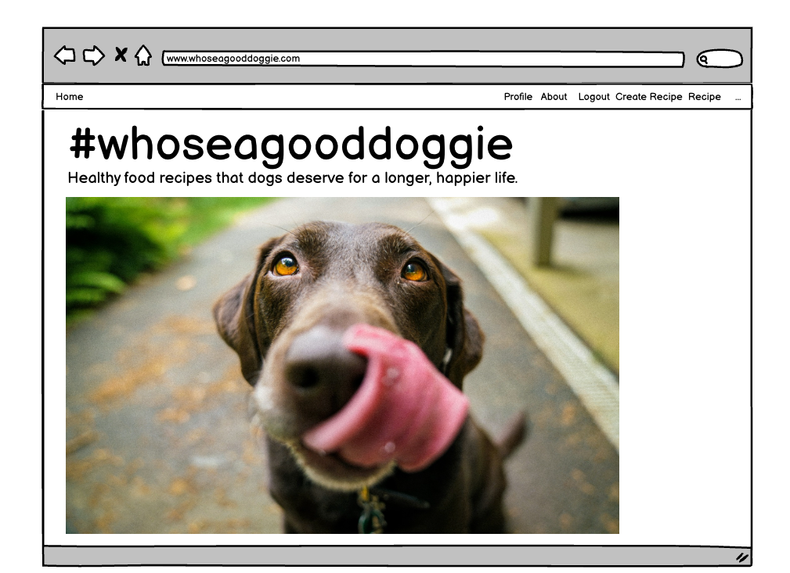
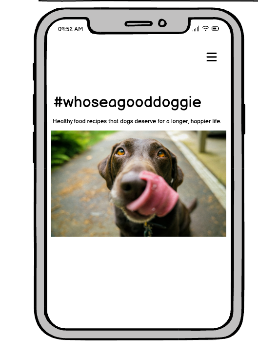
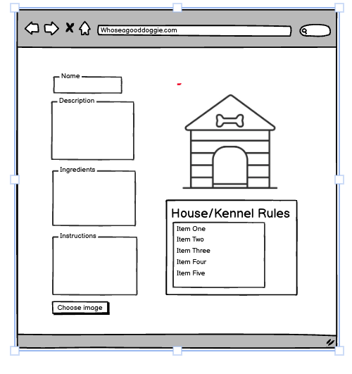
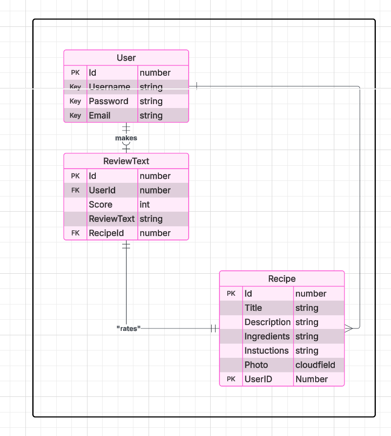

# MenuK9

#Whoseagooddoggie 

Deployed link: https://menuk9-d1fa42538dda.herokuapp.com/

Recipes for a healthier, happier dog 

whoseagooddoggie

Overview

A lot of dogs don't get the food they deserve. With the right stuff they can live up to 3 years longer.

Problem

With over-reliance on pre-prepared branded FMCG food, dog owners are too often unaware of how a balanced and healthy diet using fresh and hand-prepared food can have a dramatic impact on their dog's wellbeing. In fact new research from Mars Petcare reveals that while 8 in 10 UK dog owners care for deeply about their dog's nutrition, only a quarter understand where their dog's food comes from.

Purpose

This site aims to lightheartedly drive home the message that good food for all dogs can be better for owners and their pets, by suggesting healthy canine meals that can increase longevity, boost the immune system, reduce obesity and illness and arguably reduce vet fees.

Description

Target Audience

Dog lovers and carers. And hopefully, dogs.

Wireframes:

Home page desktop 

Mobile Home page

About Page

Entity Relationship Diagram

For simplicity and to cater to the needs of different user types (all dog lovers and owners) as well as keeping the site intuitive, clean and functional, the site uses a generic user model with a one to many relationship: one user can create many recipes.

Deployment

The project is deployed using the following steps:

Heroku The site was deployed to Heroku from the main branch of the repository early in the development stage for continuous deployment and checking.
The Heroku app is setup with 3 environment variables, replacing the environment variables stored in env.py (which doesn't get pushed to github).

In order to create an Heroku app:

Click on New in the Heroku dashboard, and Create new app from the menu dropdown.

Give your new app a unique name, and choose a region, preferably one that is geographically closest to you.

Click "Create app"

In your app settings, click on "Reveal Config Vars" and add the environment variables for your app. These are:

- DATABASE_URL - your database connection string
- SECRET_Key - the secret key for your app
- CLOUDINARY_URL - the cloudinary url for your image store
The PostgreSQL database is served from ElephantSQL

Once the app setup is complete, click on the Deploy tab and:

1. Connect to the required GitHub account
2. Select the repository to deploy from
3. Click the Deploy Branch button to start the deployment.
4. Once deployment finishes the app can be launched.

Version Control: Code is managed using Git and GitHub.
The GitHub Repository can be found here: https://github.com/benwade37/MenuK9/deployments/menuk9

Use of AI:

Use of AI Artificial Intelligence played a significant role in the development of this project. Here are some ways AI was utilised:

Planning and Design AI tools like Copilot were used to generate ideas and suggestions for the project. These tools provided insights and recommendations for the website's layout, features, and functionality. This helped streamline the planning and design process and ensure a more user-friendly and engaging final product. AI was also used on Lucidchart to create an ERD model.

Code Generation

Copilot was used to generate code snippets for various parts of the website. This included HTML structure and CSS styling and some Javascript programming. The AI provided context-aware suggestions that helped streamline the coding process and reduce development time.

Debugging AI-powered debugging tools were utilised to identify and fix issues in the code. These tools analysed the codebase, detected potential bugs, and provided recommendations for resolving them. This ensured a smoother development process and a more robust final product. Accessibility Improvements

AI was used to analyse the website's accessibility features. Tools like Lighthouse provided insights into how accessible the website is for users with disabilities and suggested improvements to enhance user experience. By leveraging AI, the project was able to achieve a higher level of efficiency, creativity, and accessibility.